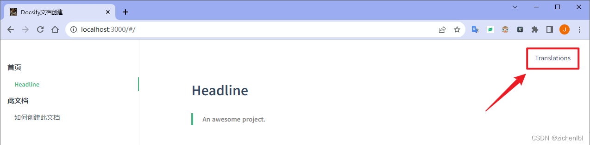
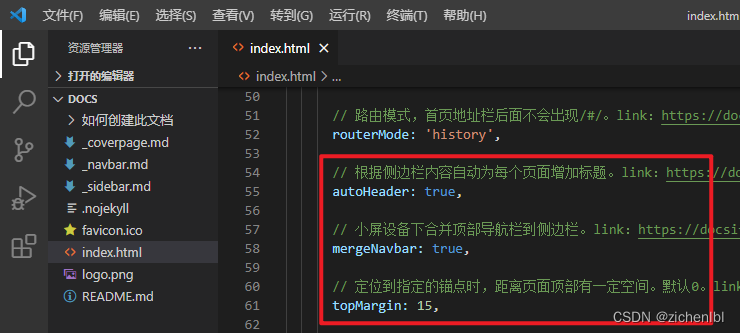
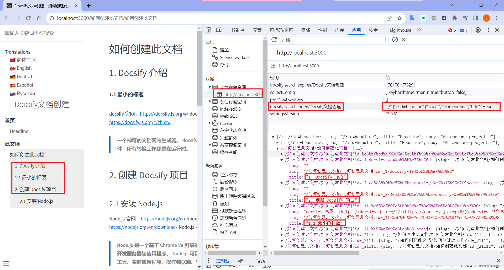
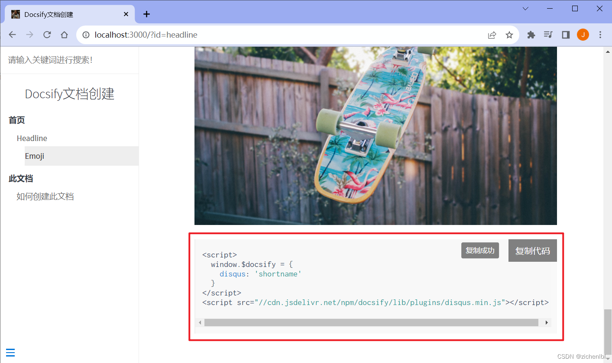
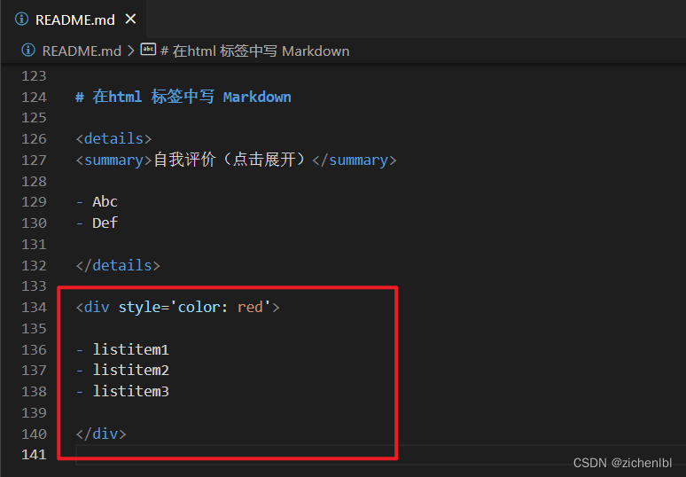
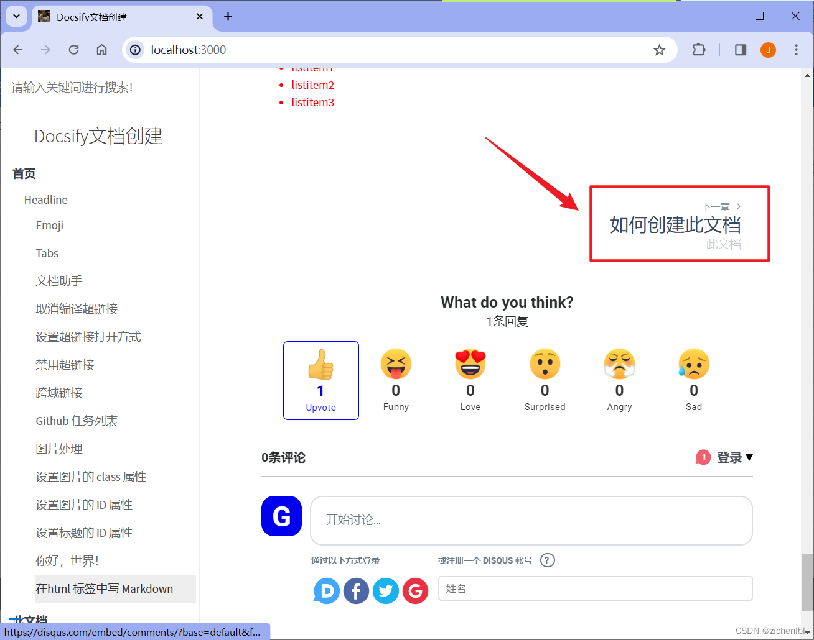
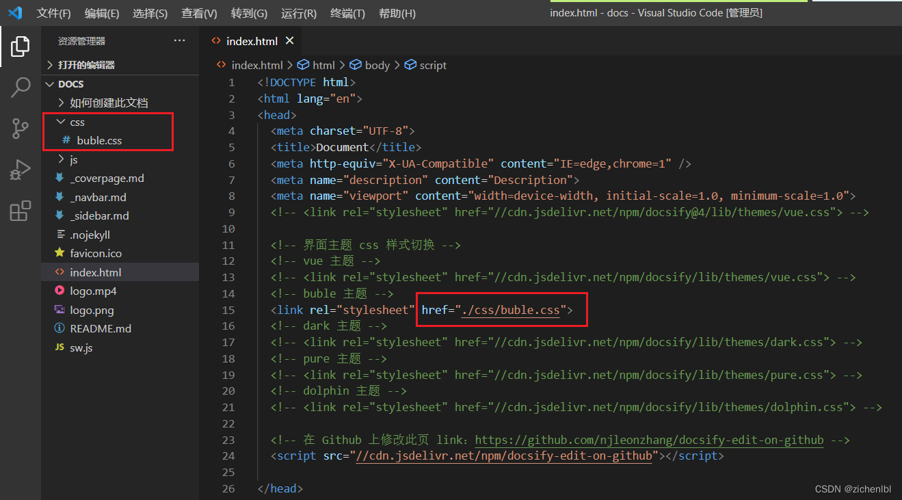
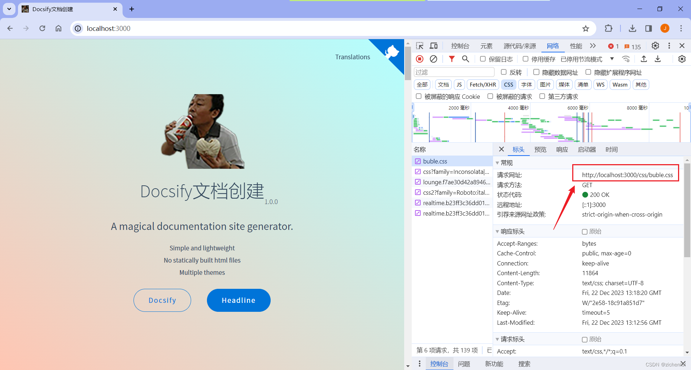
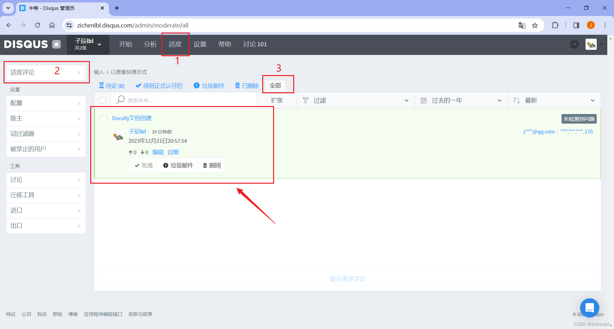

## TODO
?> 图片不显示问题会尽快解决，截止时间：2024年01月01日

## 1. Docsify 介绍

###### 1.1 最小的标题

docsify 官网：[https://docsify.js.org/#/](https://docsify.js.org/#/)
docsify 中文官网：[https://docsify.js.org/#/zh-cn/](https://docsify.js.org/#/zh-cn/)

> 一个神奇的文档网站生成器。
> docsify 不会生成静态的 .html 文件，所有转换工作都是在运行时。

## 2. 创建 Docsify 项目
### 2.1 安装 Node.js
Node.js 官网：[https://nodejs.org/en](https://nodejs.org/en)
Node.js 官网下载页面：[https://nodejs.org/en/download/](https://nodejs.org/en/download/)
Node.js 中文官网：[https://nodejs.cn/](https://nodejs.cn/)

> Node.js 是一个基于 Chrome V8 引擎的 JavaScript 运行环境，用于开发服务器端应用程序。
> Node.js 可以开发Web应用程序、命令行工具、实时应用程序、操作数据库、异步编程、分布式部署等。

进入 [Node.js 官网](https://nodejs.org/en)，点击 LTS 长期支持版本下载 .msi 安装包。


运行安装包，一直选 Next 下一步进行安装，安装成功。


CMD命令提示符中输入 `node --version` 查看 nodejs 版本，显示版本号正确，即可以正常使用。


### 2.1 安装 docsfiy-cli
下载 Node.js 包 `docsify-cli`。`-g` 全局安装可以将模块安装到全局环境，使得无论在哪个目录下，都可以轻松调用这个模块。。
```bash
npm i docsify-cli -g
```

安装成功。


全局安装的位置。


安装 Node.js 后系统环境变量 Path 中会添加这个 npm 的路径。


安装 docsify-cli 后就可以在任何位置使用 `docsify` 命令调用 `docsify.cmd` 程序，然后会执行这个路径的 docsify 文件。


### 2.3 初始化项目
打开一个文件夹，在地址栏中输入 `cmd` 并按回车，就会打开 CMD 命令提示符并进入当前文件夹。


初始化一个项目，项目文件夹名称叫 `docs`。
```bash
docsify init ./docs
```


项目文件夹名称 docs。


项目文件。

> .nojekyll 用于阻止 GitHub Pages 忽略掉下划线开头的文件
> index.html 入口文件
> README.md 会作为主页内容渲染


### 2.4 运行项目
本地预览项目运行的效果。
```bash
docsify serve ./docs
```


浏览器访问 [http://localhost:3000](http://localhost:3000) 预览效果。


### 2.5 使用 Python 运行项目（扩展，不推荐有bug）
如果你安装了 Python，也可以使用 python 启动一个静态服务器去预览项目运行的效果。
`cd` 进入项目文件夹 `docs` ，并且用 python 启动 HTTP 服务器。 
```python
cd ./docs && python -m http.server 3001
```


浏览器访问 [http://localhost:3001](http://localhost:3001) 预览效果。


## 3. 配置 Docsify 项目
### 3.1 修改等待加载文字
修改为如下内容。
```bash
Loading...（根据网络情况若等待时间较长请刷新页面重试！）
```


文档内容过多或网络缓慢则加载提示文字。


### 3.2 添加网站 ico 图标
制作 ico 图标网站1：[https://www.bitbug.net/](https://www.bitbug.net/)
制作 ico 图标网站2：[http://www.ico8.net/](http://www.ico8.net/)
制作 ico 图标网站3：[https://www.butterpig.top/icopro](https://www.butterpig.top/icopro)

制作好的图标，保存到 `docs` 目录中，重命名为 `favicon.ico`。


打开浏览器，按 F12 打开控制台，在刷新按钮上右键，选择清空缓存并硬性重新加载。重新加载后网页标签页左上角显示 ico 图标。


### 3.3 创建新页面写文档
创建一个文件夹：`如何创建此文档` ，在文件夹中创建 md 文件：`如何创建此文档.md`。


打开 `如何创建此文档.md` 文件，写入内容。


浏览器访问 [http://localhost:3000/#/如何创建此文档/如何创建此文档.md](http://localhost:3000/#/如何创建此文档/如何创建此文档.md) 预览效果。


### 3.4 添加新页面到首页侧边栏
上面添加的新页面，左侧侧边栏只显示了当前页面的导航标题，缺少了首页导航标题。
这时我们可以自定义一个侧边栏，在侧边栏中添加首页导航标题和新页面的导航标题。

在 `docs` 目录中创建 `_sidebar.md` 文件。


文件内容如下，`/` 表示 `docs` 目录；"Docsify文档创建" 表示当前页面的标签页上的标题，可以更好的 SEO。
```bash
* 首页

  * [Headline](/ "Docsify文档创建")

* 此文档

  * [如何创建此文档](/如何创建此文档/如何创建此文档.md "Docsify文档创建 - 如何创建此文档")

```

添加配置项如下。

```javascript
loadSidebar: true,
subMaxLevel: 6,
```


浏览器访问 [http://localhost:3000/#/](http://localhost:3000/#/) 预览效果。


### 3.5 添加顶部导航
在 `docs` 目录中创建 `_navbar.md` 文件。


文件内容如下，`:cn:` 会解析成 `emoji` 图标；`/` 表示 `docs` 目录；`/en/` 表示 `docs/en/` 目录，如有需要可以创建 `en` 文件夹。

```bash
- Translations
  - [:cn: 简体中文](/)
  - [:uk: English](/en)
  - [:de: Deutsch](/de-de/)
  - [:es: Español](/es/)
  - [:ru: Русский](/ru-ru/)
```

添加配置项如下。

```javascript
loadNavbar: true,
```


浏览器访问 [http://localhost:3000/#/](http://localhost:3000/#/) 预览效果。




### 3.6 添加首页封面
在 `docs` 目录中添加 `logo.png` 图片。


在 `docs` 目录中创建 `_coverpage.md` 文件。


文件内容如下，`/logo.png` 表示 `docs` 目录下的 `logo.png` 图片；`/#Headline` 表示跳转到首页 `Headline` 标题。

```bash


# Docsify文档创建 <small>1.0.0</small>

> A magical documentation site generator.

- Simple and lightweight
- No statically built html files
- Multiple themes

[Docsify](https://github.com/docsifyjs/docsify/)
[Headline](/#Headline)
```

添加配置项如下。

```javascript
coverpage: {
  '/': '_coverpage.md',
}
```


浏览器访问 [http://localhost:3000/#/](http://localhost:3000/#/) 预览效果。点击 `Headline` 按钮会跳转到 Headline 标题。


### 3.7 使用主题
注释删除默认的 vue 主题，然后添加配置项如下，使用 buble 主题。

```html
<link rel="stylesheet" href="//cdn.jsdelivr.net/npm/docsify/lib/themes/buble.css">
```

或者使用其他主题。

```html
<!-- <link rel="stylesheet" href="//cdn.jsdelivr.net/npm/docsify/lib/themes/vue.css"> -->
<!-- <link rel="stylesheet" href="//cdn.jsdelivr.net/npm/docsify/lib/themes/dark.css"> -->
<!-- <link rel="stylesheet" href="//cdn.jsdelivr.net/npm/docsify/lib/themes/pure.css"> -->
<!-- <link rel="stylesheet" href="//cdn.jsdelivr.net/npm/docsify/lib/themes/dolphin.css"> -->
```


浏览器访问 [http://localhost:3000/#/](http://localhost:3000/#/) 预览效果。


### 3.8 设置侧边栏上方的文档标题
添加配置项如下。

```javascript
name: 'Docsify文档创建',
```


浏览器访问 [http://localhost:3000/#/](http://localhost:3000/#/) 预览效果。


### 3.9 设置文档标题的跳转链接
添加配置项如下。

```javascript
nameLink: {
  '/': '/#/?id=docsify文档创建-100',
},
```


浏览器访问 [http://localhost:3000/#/](http://localhost:3000/#/) 预览效果。点击 `Docsify文档创建`，跳转到对应的标题 `docsify文档创建-100`。


### 3.10 去掉地址栏中的`/#`
添加配置项如下。修改路由模式为 `history`，就不会出现 `/#`；修改之前的链接地址不用 `/#` 开头。

```javascript
nameLink: {
  '/': '/?id=docsify文档创建-100',
},

routerMode: 'history',
```


浏览器访问 [http://localhost:3000](http://localhost:3000) 预览效果。


### 3.11 每个页面顶部自动添加侧边栏标题
添加配置项如下。

```javascript
autoHeader: true,

mergeNavbar: true,

topMargin: 15,
```



浏览器访问 [http://localhost:3000](http://localhost:3000) 预览效果。
- [x] 根据侧边栏内容自动为每个页面增加标题。


- [x] 小屏设备下合并顶部导航栏到侧边栏。


- [x] 定位到指定的锚点时，距离页面顶部有一定空间。

默认 0 ，未设置的效果，标题距离顶部很近。


设置为 15 后的效果，定位到标题时，标题距离页面顶部有一定空间。


## 4. 添加 Docsify 插件
### 4.1 设置侧边栏顶部的搜索框
- [x] 全文搜索 - Search

添加配置项如下。

```javascript
search: {

  maxAge: 86400000, 

  paths: [
    '/',                            
    '/如何创建此文档/如何创建此文档',
  ], 

  placeholder: {
    '/': '请输入关键词进行搜索！',
  },

  noData: {
    '/': '未搜索到结果，换个关键词试试！',
  },

  depth: 6,

  hideOtherSidebarContent: false,

  namespace: 'Docsify文档创建',

  pathNamespaces: [
    '/如何创建此文档',
  ],
  
},
```


查看本地索引的命名空间 `Docsify文档创建`，根据文件列表生成的本地搜索索引。



添加 js 配置项如下。

```javascript
<script src="//cdn.jsdelivr.net/npm/docsify/lib/plugins/search.min.js"></script>

<script src="//polyfill.io/v3/polyfill.min.js?features=String.prototype.normalize"></script>
```


浏览器访问 [http://localhost:3000](http://localhost:3000) 预览效果。


### 4.2 添加 emoji 表情插件
- [x] emoji

添加 js 配置项如下。

```javascript
<script src="//cdn.jsdelivr.net/npm/docsify/lib/plugins/emoji.min.js"></script>
```


在 `docs\README.md` 文件中添加如下 emoji 表情。

```Markdown
# Emoji

:smile: :laughing: :blush: :smiley: :relaxed: :smirk: :heart_eyes: :kissing_heart: :kissing_closed_eyes:
```

浏览器访问 [http://localhost:3000](http://localhost:3000) 预览效果。


### 4.3 添加外链脚本执行 src 引用的 js
- [x] 外链脚本 - External Script

添加 js 配置项如下。

```javascript
<script src="//cdn.jsdelivr.net/npm/docsify/lib/plugins/external-script.min.js"></script>
```


浏览器访问 [http://localhost:3000](http://localhost:3000) 预览效果。

### 4.4 添加图片缩放插件
- [x] 图片缩放 - Zoom image

更多使用参考视频：[https://www.bilibili.com/video/BV1tQ4y1V7DR](https://www.bilibili.com/video/BV1tQ4y1V7DR)

添加 js 配置项如下。

```javascript
<script src="//cdn.jsdelivr.net/npm/docsify/lib/plugins/zoom-image.min.js"></script>
```


在 README.md 中使用 img 标签添加一张图片。

```html

```


浏览器访问 [http://localhost:3000](http://localhost:3000) 预览效果。


### 4.5 复制到剪切板
- [x] 复制到剪贴板

添加配置项如下。

```javascript
copyCode: {
  buttonText: {
    '/': '复制代码',
    '/en/': 'Copy to clipboard',
  },
  errorText: {
    '/': '复制失败',
    '/en/': 'Error',
  },
  successText: {
    '/': '复制成功',
    '/en/': 'Copied',
  },
},
```


添加 js 配置项如下。

```javascript
<script src="//cdn.jsdelivr.net/npm/docsify-copy-code/dist/docsify-copy-code.min.js"></script>
```


在 `docs\README.md` 文件中添加如下。然后取消注释第一行和最后一行（Markdown 代码片语法）。

```javascript
//```javascript
<script>
  window.$docsify = {
    disqus: 'shortname'
  }
</script>
<script src="//cdn.jsdelivr.net/npm/docsify/lib/plugins/disqus.min.js"></script>
//```
```


浏览器访问 [http://localhost:3000](http://localhost:3000) 预览效果。

鼠标未移动到代码上效果。


鼠标移动到代码上出现复制代码按钮。


点击复制代码，提示复制成功。然后就可以 Ctrl + V 粘贴代码了。


### 4.6 字数统计
- [x] 字数统计

添加配置项如下。

```javascript
count:{
  countable: true,
  position: 'top',
  margin: '10px',
  float: 'right',
  fontsize:'0.9em',
  color:'rgb(90,90,90)',
  language:'chinese',
  localization: {
    words: "",
    minute: ""
  },
  isExpected: true,
}
```

添加 js 配置项如下。

```javascript
<script src="//unpkg.com/docsify-count/dist/countable.js"></script>
```


浏览器访问 [http://localhost:3000](http://localhost:3000) 预览效果。


### 4.7 Tabs 选项卡
- [x] Tabs 选项卡

添加配置项如下。

```javascript
tabs: {
  persist    : true,
  sync       : true, 
  theme      : 'classic', 
  tabComments: true,     
  tabHeadings: true     
},
```

添加 js 配置项如下。

```javascript
<script src="https://cdn.jsdelivr.net/npm/docsify-tabs@1"></script>
```


在 `docs\README.md` 文件中添加如下。

```html
<!-- tabs:start -->

#### **Tab1**

这是 Tab1

#### **Tab2**

这是 Tab2

<!-- tabs:end -->
```


浏览器访问 [http://localhost:3000](http://localhost:3000) 预览效果。


### 4.8 代码高亮
- [x] 代码高亮

访问 [https://cdn.jsdelivr.net/npm/prismjs@1/components/](https://cdn.jsdelivr.net/npm/prismjs@1/components/) 查找对应语言的代码高亮的 js 文件。


添加 js 配置项如下。
添加 Bash、PHP 语言代码高亮，则引用 prism-bash.min.js、prism-php.min.js 文件。

```javascript
<script src="//cdn.jsdelivr.net/npm/prismjs@1/components/prism-bash.min.js"></script>
<script src="//cdn.jsdelivr.net/npm/prismjs@1/components/prism-php.min.js"></script>
```

在 `docs\README.md` 文件中添加如下。删除 ```前面的 // 注释。

```html

//```bash
#!/bin/bash  
  
# 打印欢迎消息  
echo "欢迎来到Bash脚本示例！"  

# 定义变量  
name="John Doe"  
age=30  
//```

//```php
<?php  

// 打印欢迎消息  
echo "欢迎来到PHP代码示例！";  
  
// 定义变量  
$name = "John Doe";  
$age = 30;  
 
?>
//```
```


浏览器访问 [http://localhost:3000](http://localhost:3000) 预览效果。


### 4.9 强调内容
- [x] 强调内容
- [x] 普通提示

在 `docs\README.md` 文件中添加如下。!> 表示强调内容；?> 表示普通提示。

```html
# 文档助手

!> 强调内容

?> 普通提示
```

浏览器访问 [http://localhost:3000](http://localhost:3000) 预览效果。


### 4.10 取消编译超链接
- [x] 忽略编译链接

有时候我们把相对地址放在超链接上，如果不需要 Docsify 对超链接编译，就可以使用如下写法。在后面添加 `':ignore'`。

```html
[link](/demo/ ':ignore')
```

超链接会原样显示为 `<a href="/demo/">link</a>`。

添加带有标题的超链接，这意味着当你将鼠标悬停在该链接上时，浏览器会显示该标题的值作为工具提示。则如下添加。

```html
[link](/demo/ ':ignore title')
```

超链接会显示为 `<a href="/demo/" title="title"`。

在 `docs\README.md` 文件中添加如下。

```html
[link](/demo/ ':ignore')

[link](/demo/ ':ignore title')
```


浏览器访问 [http://localhost:3000](http://localhost:3000) 预览效果。
不会编译成访问 /demo/README.md。


带有标题的超链接。


### 4.11 设置超链接打开方式
- [x] 设置链接的 target 属性

在当前页面打开。

```html
[link](https://docsify.js.org/#/zh-cn/ ':target=_self')
```

在新标签页打开。

```html
[link](https://docsify.js.org/#/zh-cn/ ':target=_blank')
```

在 `docs\README.md` 文件中添加如下。

```html
[link](https://docsify.js.org/#/zh-cn/ ':target=_self')

[link](https://docsify.js.org/#/zh-cn/ ':target=_blank')
```


浏览器访问 [http://localhost:3000](http://localhost:3000) 预览效果。


### 4.12 禁用超链接	
- [x] 禁用链接

如下写法可以禁用该超链接。

```html
[link](/demo ':disabled')
```

在 `docs\README.md` 文件中添加如下。

```html
[link](/demo ':disabled')
```


浏览器访问 [http://localhost:3000](http://localhost:3000) 预览效果。
鼠标移动到超链接上，超链接被禁用点击不了。


### 4.13 跨域链接
- [x] 跨域链接

当你同时设置了 routerMode: 'history' 和 externalLinkTarget: '_self' 时，你需要为这些跨域链接添加这个配置。
在 `docs\README.md` 文件中添加如下。

```html
[example.com](https://example.com/ ':crossorgin')
```


浏览器访问 [http://localhost:3000](http://localhost:3000) 预览效果。


### 4.14 Github 任务列表
- [x] Github 任务列表

使用如下语法可以显示为任务列表，勾选已完成的任务。
在 `docs\README.md` 文件中添加如下。

```html
- [ ] 未完成的任务

- [x] 已完成的任务
```


浏览器访问 [http://localhost:3000](http://localhost:3000) 预览效果。


### 4.15 图片处理
- [x] 图片处理
#### 4.15.1 图片显示缩放后大小
- [x] 图片显示缩放后大小

图片显示缩放后大小，宽 x 高。
在 `docs\README.md` 文件中添加如下。

```html
 
 


 <!-- 支持按百分比缩放 --> 

```


浏览器访问 [http://localhost:3000](http://localhost:3000) 预览效果。


#### 4.15.2 设置图片的 class 属性
- [x] 设置图片class属性

如下给图片添加 class 属性：someCssClass。
在 `docs\README.md` 文件中添加如下。

```html

```


浏览器访问 [http://localhost:3000](http://localhost:3000) 预览效果。
图片 class 添加了 someCssClass。


#### 4.15.3 设置图片的 ID 属性
- [x] 设置图片的 ID 属性

如下给图片添加 id 属性：someCssId。
在 `docs\README.md` 文件中添加如下。

```html

```


浏览器访问 [http://localhost:3000](http://localhost:3000) 预览效果。
图片 id 添加了 someCssId。


### 4.16 设置标题的 ID 属性
- [x] 设置标题的 id 属性

如下给标题添加 id 属性：hello-world。
在 `docs\README.md` 文件中添加如下。

```html
### 你好，世界！ :id=hello-world
```


浏览器访问 [http://localhost:3000](http://localhost:3000) 预览效果。
标题 id 添加了 hello-world。


### 4.17 在 html 标签中写 Markdown
- [x] html 标签中的 Markdown

当你需要在 details 元素中渲染 Markdown，你需要在 html 和 Markdown 内容中插入空行。 
如下在 html 标签中写 Markdown 内容。

```html
<details>
<summary>自我评价（点击展开）</summary>

- Abc
- Def

</details>
```


浏览器访问 [http://localhost:3000](http://localhost:3000) 预览效果。
与 summary 标签配合使用可以为 details 定义标题。标题是可见的，用户点击标题时，会显示出 details。
如下，点击自我评价，展开后显示出 MarkDown 内容。


Markdown 内容也可以被 html 标签包裹。

```html
<div style='color: red'>

- listitem
- listitem
- listitem

</div>
```



浏览器访问 [http://localhost:3000](http://localhost:3000) 预览效果。
如下，Markdown 内容显示为红色。


### 4.18 Pagination 底部分页导航
- [x] Pagination 分页导航

在文章底部显示上一页，下一页导航。


添加配置项如下。

```javascript
pagination: {
  previousText: '上一章',
  nextText: {
    '/en/': 'NEXT',
    '/': '下一章'
  },
  crossChapter: true,
  crossChapterText: true,
},
```


添加 js 配置项如下。

```javascript
<script src="//unpkg.com/docsify-pagination/dist/docsify-pagination.min.js"></script>
```


浏览器访问 [http://localhost:3000](http://localhost:3000) 预览效果。
文章底部显示上一页、下一页导航。




### 4.19 支持使用 Vue 语法
- [x] 兼容 Vue

你可以直接在 Markdown 文件里写 Vue 代码，它将被执行。
详细使用说明：[https://docsify.js.org/#/zh-cn/vue?id=%e5%85%bc%e5%ae%b9-vue](https://docsify.js.org/#/zh-cn/vue?id=%e5%85%bc%e5%ae%b9-vue)

添加配置项如下。

```javascript
vueGlobalOptions: {
  data() {
    return {
      count: 0,
    };
  },
},
```


添加 js 配置项如下。添加 Vue3 开发版。

```javascript
<script src="//cdn.jsdelivr.net/npm/vue@3/dist/vue.global.js"></script>
```


在 `docs\README.md` 文件中添加如下。

```html
<ul>
  <li v-for="i in 3">Item {{ i }}</li>
</ul>

<p>2 + 2 = {{2+2}}</p> 

<p>
  <button @click="count -= 1">-</button>
  {{ count }}
  <button @click="count += 1">+</button>
</p>
```


浏览器访问 [http://localhost:3000](http://localhost:3000) 预览效果。
点击加号可以改变中间数字的值。


### 4.20 离线模式（PWA）
- [x] 离线模式

> Progressive Web Apps (PWA) 是一项融合 Web 和 Native 应用各项优点的解决方案。我们可以利用其支持离线功能的特点，让我们的网站可以在信号差或者离线状态下正常运行。 要使用它也非常容易。

在 `docs/` 目录中创建一个 `sw.js`，并粘贴以下代码。

```javascript
/* ===========================================================
 * docsify sw.js
 * ===========================================================
 * Copyright 2016 @huxpro
 * Licensed under Apache 2.0
 * Register service worker.
 * ========================================================== */

const RUNTIME = 'docsify'
const HOSTNAME_WHITELIST = [
  self.location.hostname,
  'fonts.gstatic.com',
  'fonts.googleapis.com',
  'cdn.jsdelivr.net'
]

// The Util Function to hack URLs of intercepted requests
const getFixedUrl = (req) => {
  var now = Date.now()
  var url = new URL(req.url)

  // 1. fixed http URL
  // Just keep syncing with location.protocol
  // fetch(httpURL) belongs to active mixed content.
  // And fetch(httpRequest) is not supported yet.
  url.protocol = self.location.protocol

  // 2. add query for caching-busting.
  // Github Pages served with Cache-Control: max-age=600
  // max-age on mutable content is error-prone, with SW life of bugs can even extend.
  // Until cache mode of Fetch API landed, we have to workaround cache-busting with query string.
  // Cache-Control-Bug: https://bugs.chromium.org/p/chromium/issues/detail?id=453190
  if (url.hostname === self.location.hostname) {
    url.search += (url.search ? '&' : '?') + 'cache-bust=' + now
  }
  return url.href
}

/**
 *  @Lifecycle Activate
 *  New one activated when old isnt being used.
 *
 *  waitUntil(): activating ====> activated
 */
self.addEventListener('activate', event => {
  event.waitUntil(self.clients.claim())
})

/**
 *  @Functional Fetch
 *  All network requests are being intercepted here.
 *
 *  void respondWith(Promise<Response> r)
 */
self.addEventListener('fetch', event => {
  // Skip some of cross-origin requests, like those for Google Analytics.
  if (HOSTNAME_WHITELIST.indexOf(new URL(event.request.url).hostname) > -1) {
    // Stale-while-revalidate
    // similar to HTTP's stale-while-revalidate: https://www.mnot.net/blog/2007/12/12/stale
    // Upgrade from Jake's to Surma's: https://gist.github.com/surma/eb441223daaedf880801ad80006389f1
    const cached = caches.match(event.request)
    const fixedUrl = getFixedUrl(event.request)
    const fetched = fetch(fixedUrl, { cache: 'no-store' })
    const fetchedCopy = fetched.then(resp => resp.clone())

    // Call respondWith() with whatever we get first.
    // If the fetch fails (e.g disconnected), wait for the cache.
    // If there’s nothing in cache, wait for the fetch.
    // If neither yields a response, return offline pages.
    event.respondWith(
      Promise.race([fetched.catch(_ => cached), cached])
        .then(resp => resp || fetched)
        .catch(_ => { /* eat any errors */ })
    )

    // Update the cache with the version we fetched (only for ok status)
    event.waitUntil(
      Promise.all([fetchedCopy, caches.open(RUNTIME)])
        .then(([response, cache]) => response.ok && cache.put(event.request, response))
        .catch(_ => { /* eat any errors */ })
    )
  }
})
```


现在，到 index.html 里注册它。这个功能只能工作在一些现代浏览器上，所以我们需要加个判断。

index.html

```html
<script>
  if (typeof navigator.serviceWorker !== 'undefined') {
    navigator.serviceWorker.register('sw.js')
  }
</script>
```


发布你的网站，并开始享受离线模式的魔力吧！ghost 当然你现在看到的 docsify 的文档网站已经支持离线模式了，你可以关掉 Wi-Fi 体验一下。


### 4.21 文件嵌入
- [x] 文件嵌入

> docsify 4.6 开始支持嵌入任何类型的文件到文档里。你可以将文件当成 iframe、video、audio 或者 code block，如果是 Markdown 文件，甚至可以直接插入到当前文档里。

当前，嵌入的类型是通过文件后缀自动识别的，这是目前支持的类型：


文件类型 | 文件后缀
-------------|------------
iframe | .html, .htm
markdown | .markdown, .md
audio | .mp3
video | .mp4, .ogg
code | other file extension

在 `docs\` 目录中添加 `logo.mp4` 文件。

在 `docs\README.md` 文件中添加如下。

```html
[logo](./logo.mp4 ':include')
```


浏览器访问 [http://localhost:3000](http://localhost:3000) 预览效果。
嵌入可以播放的 mp4 文件。


### 4.22 IIS 部署
#### 4.22.1 添加网站
Docsify 项目目录：`D:\Website\Docsify\iis`


#### 4.22.2 安装 url 重写
下载地址1：[https://iis-umbraco.azurewebsites.net/downloads/microsoft/url-rewrite](https://iis-umbraco.azurewebsites.net/downloads/microsoft/url-rewrite)
下载地址2：[https://www.iis.net/downloads/microsoft/url-rewrite](https://www.iis.net/downloads/microsoft/url-rewrite)


修改 `D:\Website\Docsify\iis\web.config`文件。标识 md 文件，请求重写到 /index.html 页面。

```xml
<?xml version="1.0" encoding="UTF-8"?>
<configuration>
    <system.webServer>
        <staticContent>
            <mimeMap fileExtension=".md" mimeType="text/md" />
        </staticContent>
    <rewrite>
      <rules>
        <rule name="ReactRouter" patternSyntax="ECMAScript" stopProcessing="true">
          <match url=".*" />
          <conditions>
            <add input="{HTTP_METHOD}" pattern="^GET$" />
            <add input="{HTTP_ACCEPT}" pattern="^text/html" />
            <add input="{REQUEST_FILENAME}" matchType="IsFile" negate="true" />
          </conditions>
          <action type="Rewrite" url="/index.html" />
        </rule>
      </rules>
    </rewrite>
    </system.webServer>
</configuration>
```

访问网站：[http://localhost:9999](http://localhost:9999)


### 4.23 网页保存为应用


### 4.24 不联网使用本地 js 文件 
- [x] 不联网使用本地 js 文件 

新建 js 文件夹，在里面存放本地 js 文件。


下载需要的 js 文件。


访问 js 地址，右键另存为，保存到本地。


然后修改为本地 js 引用地址。


浏览器访问 [http://localhost:3000](http://localhost:3000) 预览效果。
然后再保存其它 js 文件到本地。


### 4.25 不联网使用本地 css 文件
- [x] 不联网使用本地 css 文件

新建 css 文件夹，在里面存放本地 css 文件。


下载需要的 css 文件。


访问 css 地址，右键另存为，保存到本地。


然后修改为本地 css 引用地址。



浏览器访问 [http://localhost:3000](http://localhost:3000) 预览效果。
然后再保存其它 css 文件到本地。




## 5. 交互
### 5.1 Disqus 评论系统
- [x] Disqus 评论系统

Disqus 官网：[https://disqus.com/](https://disqus.com/)


注册账户。


登录后，选择我想在我的网站上安装 Disqus。


添加配置项如下。zichenlbl 就是刚才创建的网站名称。

```javascript
disqus: 'zichenlbl'
```


添加 js 配置项如下。

```javascript
<script src="//cdn.jsdelivr.net/npm/docsify/lib/plugins/disqus.min.js"></script>
```


浏览器访问 [http://localhost:3000](http://localhost:3000) 预览效果。


添加一条评论。


在 Disqus 中管理评论。




### 5.2 在 Github 上修改此页
- [x] 在 Github 上编辑

插件：[https://github.com/njleonzhang/docsify-edit-on-github](https://github.com/njleonzhang/docsify-edit-on-github)

添加配置项如下。

```javascript
plugins: [
  EditOnGithubPlugin.create(
    'https://github.com/docsifyjs/docsify/blob/master/docs',
    'https://github.com/docsifyjs/docsify/blob/master/docs',
    function(file) {
      if (file.indexOf('en') === -1) {
        return '在 Github 上编辑此页'
      } else {
        return 'edit on git'
      }
    }
  )
],
```


添加 js 配置项如下。==在 `<head></head>` 标签中添加 js 。==

```javascript
<script src="//cdn.jsdelivr.net/npm/docsify-edit-on-github"></script>
```


浏览器访问 [http://localhost:3000](http://localhost:3000) 预览效果。
点击右上角 `在 Github 上编辑此页`，会跳转到配置项中的 https://github.com/docsifyjs/docsify/blob/master/docs 地址，地址后面会自动加上当前页面的 md 文件名。


### 5.3 CDN
- [x] CDN

docsify 最新版本访问 CDN 获取。
网址：[https://docsify.js.org/#/zh-cn/cdn](https://docsify.js.org/#/zh-cn/cdn)

> CDN 是 Content Delivery Network 的缩写，即内容分发网络。它是在现有的互联网基础上再构建的一层智能虚拟网络，包括分布式存储、负载均衡、请求重定向和内容管理等。CDN能实时地根据网络流量、负载状态、用户的距离和响应时间等综合信息，把用户的请求导向离他最近地节点服务器上，使用户能就近获取所需地内容。

### 5.4 右上角 Github 挂件
- [x] 右上角 Github 挂件

添加配置项如下。'https://github.com/docsifyjs/docsify/' 修改为你的文档 github 仓库地址。

```javascript
repo: 'https://github.com/docsifyjs/docsify/'
```


浏览器访问 [http://localhost:3000](http://localhost:3000) 预览效果。
点击右上角 Github 挂件，会跳转到配置项中的 https://github.com/docsifyjs/docsify 地址。


### 5.6 部署到 Github
- [x] 部署到 Github

创建一个仓库。


执行这三步，提交到本地仓库。


然后执行这个代码，提交到 Github 仓库。


刷新 Github 页面，查看仓库。


如果需要部署免费的在线文档访问，则需要修改仓库可见性为公共。


现在该仓库就是公共访问的。


启用 Pages 功能。


访问这个地址，打开部署成功后的页面。界面有些文件没有加载成功，后面再调整仓库文件内容。


### 代码即时预览和 jsfiddle 集成 TODO
- [ ] 代码即时预览和 jsfiddle 集成

### Markdown 配置 TODO

### Gitalk 评论系统 TODO

## 6.更多插件
网址： [https://docsify.js.org/#/awesome?id=plugins](https://docsify.js.org/#/awesome?id=plugins)


### TODO
插件列表
- [ ] 谷歌统计 - Google Analytics
- [x] emoji
- [x] 外链脚本 - External Script
- [x] 图片缩放 - Zoom image
- [x] 在 Github 上编辑
- [ ] 代码即时预览和 jsfiddle 集成
- [x] 复制到剪贴板
- [x] Disqus 评论系统
- [ ] Gitalk 评论系统
- [x] Pagination 分页导航
- [x] 字数统计
- [x] Tabs 选项卡
- [ ] Markdown 配置
- [x] 代码高亮

文档助手
- [x] 强调内容
- [x] 普通提示
- [x] 忽略编译链接
- [x] 设置链接的 target 属性
- [x] 禁用链接
- [x] 跨域链接
- [x] Github 任务列表
- [x] 图片处理
- [x] 设置标题的 id 属性
- [x] html 标签中的 Markdown

其他
- [x] 兼容 Vue
- [x] CDN
- [x] 离线模式
- [ ] 服务端渲染（SSR）
- [x] 文件嵌入
- [x] IIS部署
- [x] 不联网使用本地 js 文件 

更多
- [x] 右上角 Github 挂件
- [x] 部署到 Github
